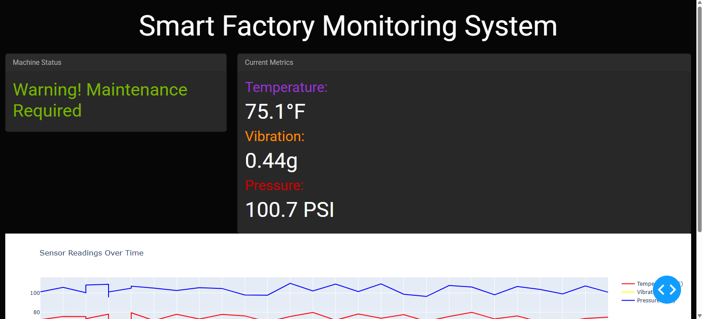

# 🚀 Smart Factory Monitoring System using MQTT  

This project is a **real-time factory monitoring system** that tracks **Temperature, Vibration, and Pressure** using **IoT, AI, and Dash**.  

## 📌 Features  
✅ Real-time sensor monitoring (**Temperature, Vibration, Pressure**)  
✅ **MQTT-based** data collection from industrial sensors  
✅ **AI-based Predictive Maintenance** using a RandomForest model  
✅ **Interactive Dashboard** built with Dash & Plotly  
✅ Supports **Simulated Data Mode** (Offline Testing)  

---

## 📷 Dashboard Screenshots  
### **Connected to MQTT**  
  

### 📊 Sensor Data Plot  


### **Not Connected to MQTT**  
  


---

## 📌 Installation Instructions  
**Clone this repository:**  
```bash
git clone https://github.com/khan-tahir/smart-factory-monitoring-mqtt.git
cd smart-factory-monitoring-mqtt


